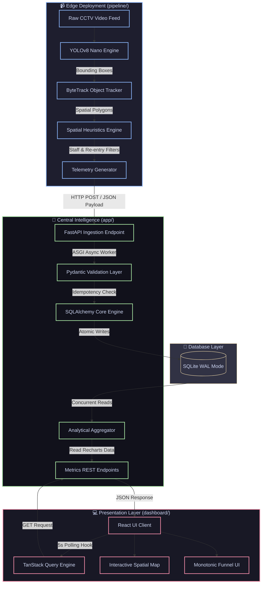

# DESIGN.md

## Architecture Overview
The Apex Retail Intelligence system is decoupled into two primary domains to isolate heavy compute from transactional API traffic:

1. **Edge Detection Pipeline (Computer Vision):** A Python worker that consumes raw video, runs object detection (YOLO) and tracking (ByteTrack), and evaluates spatial-temporal heuristics. It outputs discrete business events (e.g., `ZONE_ENTER`).
2. **Central Intelligence API (FastAPI):** A lightweight REST API backed by a SQLite database running in Write-Ahead-Log (WAL) mode. It ingests events from the pipeline and serves aggregated metrics to the frontend dashboard.

## AI-Assisted Decisions

During development, I utilized Large Language Models (LLMs) as an architectural sounding board. Here is how AI shaped the design, and where I chose to override it:

1. **Staff Detection Strategy**
   * *What AI Suggested:* Deploy a secondary deep learning classifier (e.g., ResNet) or a VLM on cropped bounding boxes to identify store uniforms.
   * *What I Changed:* I explicitly overrode this and implemented a spatial-temporal heuristic engine instead. 
   * *Why:* Running a secondary inference pass halves the pipeline's FPS on edge CPUs. By mapping employee-only zones (like the cash counter interior) and tracking `dwell_time`, the system flags a `visitor_id` as `is_staff=True` if they spend prolonged periods in restricted areas. This achieves the business requirement with zero additional compute overhead.

2. **Database Connection Management**
   * *What AI Suggested:* Standard SQLAlchemy `SessionLocal` dependency injection per request.
   * *What I Changed:* I agreed with the pattern but manually hardened the SQLite engine configuration. I added `pool_pre_ping=True`, `timeout=15`, and explicitly wrapped the FastAPI dependency in a `try/finally: db.close()` block.
   * *Why:* AI often overlooks SQLite file locking issues in concurrent environments. Because the CV pipeline writes heavily while the dashboard polls concurrently every 5 seconds, strict connection lifecycle management was necessary to prevent `OperationalError: database is locked`.

3. **Event Schema Design**
   * *What AI Suggested:* A highly normalized relational schema (separate tables for Stores, Cameras, Zones, Visitors, and Events, connected via Foreign Keys).
   * *What I Changed:* Overridden. I implemented a single, flattened `events` table.
   * *Why:* High-frequency time-series ingestion breaks down on edge devices if the database must execute multi-table joins and constraint checks per video frame. A flat schema optimizes for raw write speed, deferring the aggregation workload to the dashboard read queries.
